# Modul 295 - Dokumentation

**Autor:** Julian Schiller

**Datum:** 24.04.2026

## Inhaltsverzeichnis

1. [Libraries und Frameworks](#1-libraries-und-frameworks)
2. [API Analyse](#2-api-analyse)
3. [API Definition](#3-api-definition)
4. [REST API Dokumentation](#4-rest-api-dokumentation)
5. [Testfälle](#5-testfälle)
   - 5.1 [Adressen](#51-adressen)
   - 5.2 [Medien](#52-medien)
   - 5.3 [Kunden](#53-kunden)
   - 5.4 [Ausleihen](#54-ausleihen)

<div style="page-break-after: always;"></div>

## 1. Libraries und Frameworks

Library | Version | Zweck
--------|---------|------
Spring Boot| 4.0.5 | Application Framework
Spring Data JPA | - | DB-Zugriff
MySQL Connector | - | JDBC Driver
Lombok | - | Reduktion von Boilerplate
springdoc-openapi | 2.8.4 | API-Dokumentation via Swagger UI

Als IDE wurde VS Code verwendet und als Programmiersprache Java 21. Als Build Tool wurde Gradle 8.14.4 verwendet und Groovy als DSL.
Die History wurde mit Git gemacht, welches ebenfalls direkt mit einem [Github Repo](https://github.com/julianschiller/m295) verbunden wurde um einen zweiten Speicherort zu haben.

<div style="page-break-after: always;"></div>

## 2. API Analyse

Wer | Anforderung | HTTP-Methode
----|-------------|------------
Der Benutzer | kann alle Medienobjekte auflisten| GET
Der Benutzer | kann Medien nach Titel suchen | GET
Der Benutzer | kann ein Medienobjekt anhand der ID abrufen | GET
Der Benutzer | kann ein neues Medienobjekt erstellen | POST
Der Benutzer | kann ein bestehendes Medienobjekt aktualisieren | PATCH
Der Benutzer | kann ein Medienobjekt löschen | DELETE
Der Benutzer | kann alle Adressen auflisten | GET
Der Benutzer | kann Adressen nach Strasse und Hausnummer suchen| GET
Der Benutzer | kann Adressen nach Postleitzahl suchen | GET
Der Benutzer | kann eine neue Adresse erstellen | POST
Der Benutzer | kann eine Adresse löschen (nur wenn sie nicht referenziert wird) | DELETE
Der Benutzer | kann einen Kunden anhand der ID abrufen | GET
Der Benutzer | kann Kunden nach Namen suchen | GET
Der Benutzer | kann Kunden nach Adress-ID suchen | GET
Der Benutzer | kann einen neuen Kunden erstellen | POST
Der Benutzer | kann einen bestehenden Kunden aktualisieren | PATCH
Der Benutzer | kann einen Kunden löschen | DELETE
Der Benutzer | kann alle Ausleihen auflisten | GET
Der Benutzer | kann eine neue Ausleihe erstellen | POST
Der Benutzer | kann eine bestehende Ausleihe verlängern | PATCH
Der Benutzer | kann eine Ausleihe beenden (über mediaId) | DELETE

<div style="page-break-after: always;"></div>

## 3. API Definition

In diesem Abschnitt wird die gesamte API Definition aufgezeigt, es wird gezeigt welche URL's es gibt, der jeweilige Anwendungsfall und der Request Body.

### Medien
|URL|Methode|Anwendungsfall|Request Body|
|------|-------|---------|--------------|
/library/media|GET|Alle Medien abrufen|-
/library/media?title=|GET|Alle Medien mit bestimmtem Titel abrufen|-
/library/media/{id}|GET|Ein Medium mit bestimmter ID abrufen|-
/library/media|POST|Ein neues Medium erstellen|Das neue Medium als JSON
/library/media/{id}|PATCH|Ein bestehendes Medium bearbeiten|Das bearbeitete Medium als JSON
/library/media/{id}|DELETE|Ein Medium löschen|-

#### JSON-Struktur POST
```json
{
    "title":"",
    "author":"",
    "genre":"",
    "minage":12,
    "isbn":"",
    "locationcode":""
}
```
Titel und Autor müssen gesendet werden, alles andere ist optional.

#### JSON-Struktur PATCH
```json
{
    "genre":"",
    "minage":12,
    "isbn":"",
    "locationcode":""
}
```
Alle Attribute sind optional, aber nur diese dürfen bearbeitet werden.

<div style="page-break-after: always;"></div>

### Adresse
|URL|Methode|Anwendungsfall|Request Body|
|------|-------|---------|--------------|
/library/addresses|GET|Alle Adressen abrufen|-
/library/addresses?address=|GET|Alle Adressen mit bestimmter Strasse und Hausnummer abrufen|-
/library/addresses?zip=|GET|Alle Adressen mit bestimmter Postleitzahl abrufen|-
/library/addresses|POST|Eine neue Adresse erstellen|Die neue Adresse als JSON
/library/addresses/{id}|DELETE|Eine Adresse löschen (schlägt fehl, wenn sie noch von einem Kunden referenziert wird)|-

#### JSON-Struktur POST
```json
{
    "address":"",
    "city":"",
    "zip":""
}
```
Alle Attribute müssen gesendet werden.

### Kunde
|URL|Methode|Anwendungsfall|Request Body|
|------|-------|---------|--------------|
/library/customers/{id}|GET|Kunden mit bestimmter ID abrufen|-
/library/customers?name=|GET|Alle Kunden mit bestimmtem Namen abrufen|-
/library/customers?addressId=|GET|Alle Kunden mit bestimmter Adresse abrufen|-
/library/customers|POST|Einen neuen Kunden erstellen|Der neue Kunde als JSON
/library/customers/{id}|PATCH|Einen bestehenden Kunden bearbeiten|Der bearbeitete Kunde als JSON
/library/customers/{id}|DELETE|Einen Kunden löschen|-

#### JSON-Struktur POST
```json
{
    "firstname":"",
    "lastname":"",
    "birthdate":"YYYY-MM-DD",
    "email":"",
    "address":{
        "address":"",
        "city":"",
        "zip":""
    }
}
```
Alle Attribute müssen gesendet werden.

#### JSON-Struktur PATCH
```json
{
    "email":"",
    "address":{
        "address":"",
        "city":"",
        "zip":""
    }
}
```
Alle Attribute sind optional, aber nur diese dürfen bearbeitet werden.

<div style="page-break-after: always;"></div>

### Ausleihe
|URL|Methode|Anwendungsfall|Request Body|
|------|-------|---------|--------------|
/library/borrowings|GET|Alle Ausleihen abrufen|-
/library/borrowings|POST|Eine neue Ausleihe erstellen|Die neue Ausleihe als JSON
/library/borrowings/{id}|PATCH|Eine bestehende Ausleihe verlängern|Die bearbeitete Ausleihe als JSON
/library/borrowings?mediaId=|DELETE|Eine Ausleihe beenden|-

#### JSON-Struktur POST
```json
{
    "duration":14,
    "customer":{
        "id":3
    },
    "media":{
        "id":12
    }
}
```
Dauer ist optional (hat einen Standardwert), Kunde und Medium müssen gesendet werden.

#### JSON-Struktur PATCH
```json
{
    "duration":28
}
```
Dauer ist das einzige Attribut, das bearbeitet werden kann.

<div style="page-break-after: always;"></div>

## 4. REST API Dokumentation

Die API Dokumentation kann im zip File mit dem Namen [api-docs.json](./api-docs.json) gefunden werden.

<div style="page-break-after: always;"></div>

## 5. Testfälle

Die Tests wurden mit der VS Code REST Client Extension manuell ausgeführt. Jeder Test zeigt den gesendeten Request und die erhaltene Response.

### 5.1 Adressen

#### Alle Adressen abrufen
**Request:** `GET /library/addresses`
**Erwartet:** 200 OK, JSON Array mit allen Adressen
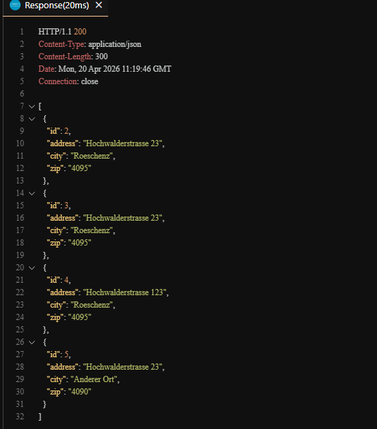

#### Adressen nach Postleitzahl filtern
**Request:** `GET /library/addresses?zip=4090`
**Erwartet:** 200 OK, JSON Array mit Adressen mit PLZ 4090
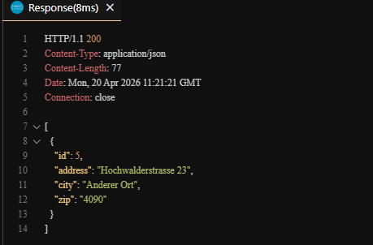

#### Adressen nach Strasse filtern
**Request:** `GET /library/addresses?address=Hochwalderstrasse 23`
**Erwartet:** 200 OK, JSON Array mit passenden Adressen
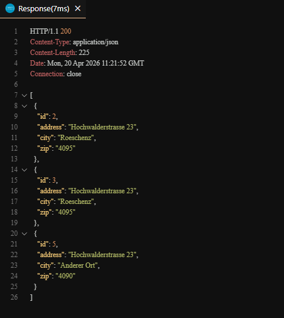

#### Neue Adresse erstellen
**Request:** `POST /library/addresses`
**Erwartet:** 201 Created, Adresse wird in der Datenbank gespeichert
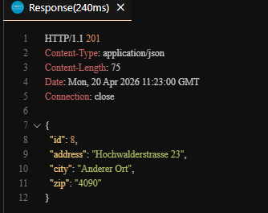

#### Adresse löschen
**Request:** `DELETE /library/addresses/2`
**Erwartet:** 204 No Content, Adresse wird gelöscht
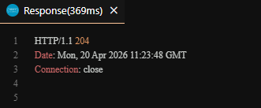

#### Verifikation: GET nach dem Löschen
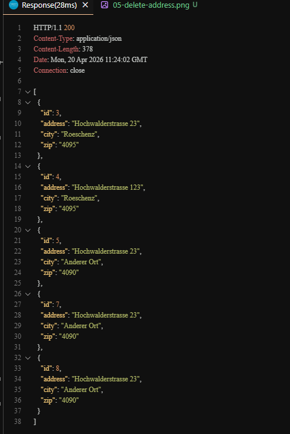

#### Referenzierte Adresse löschen
**Request:** `DELETE /library/addresses/4`
**Erwartet:** 400 Bad Request, Adresse wird noch von einem Kunden referenziert
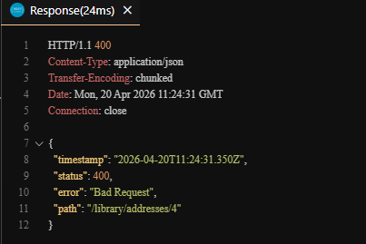

#### Nicht existierende Adresse löschen
**Request:** `DELETE /library/addresses/9999`
**Erwartet:** 404 Not Found
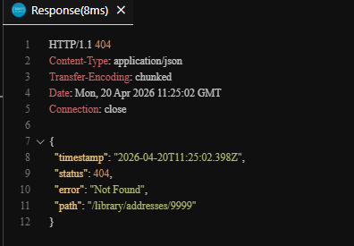

<div style="page-break-after: always;"></div>

### 5.2 Medien

#### Alle Medien abrufen
**Request:** `GET /library/media`
**Erwartet:** 200 OK, JSON Array mit allen Medien
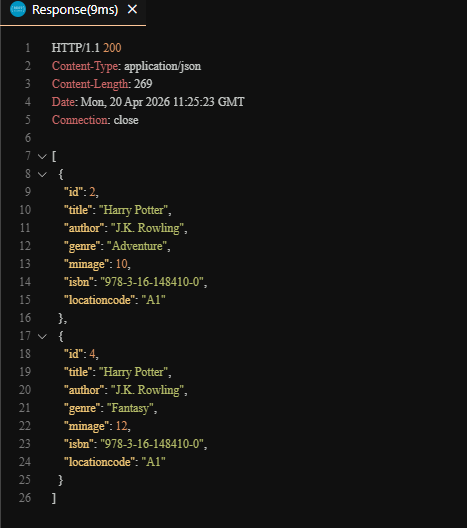

#### Medien nach Titel filtern
**Request:** `GET /library/media?title=Harry Potter`
**Erwartet:** 200 OK, JSON Array mit Medien mit Titel "Harry Potter"
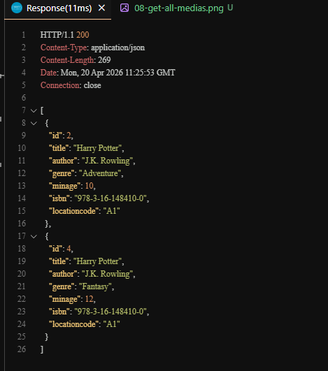

#### Medium nach ID abrufen
**Request:** `GET /library/media/2`
**Erwartet:** 200 OK, JSON Objekt des Mediums
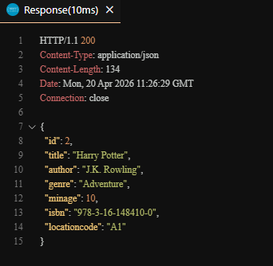

#### Nicht existierendes Medium abrufen
**Request:** `GET /library/media/9999`
**Erwartet:** 404 Not Found
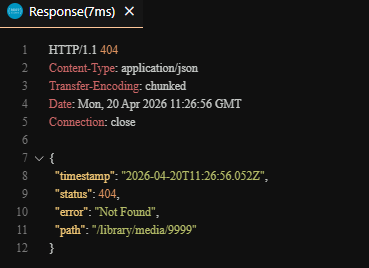

#### Neues Medium erstellen
**Request:** `POST /library/media`
**Erwartet:** 201 Created, JSON Objekt des erstellten Mediums
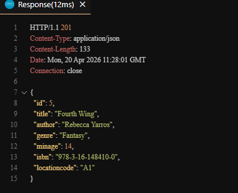

#### Medium bearbeiten
**Request:** `PATCH /library/media/5`
**Erwartet:** 200 OK, Genre und Mindestalter werden aktualisiert
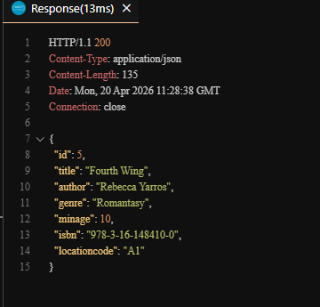

#### Nicht existierendes Medium bearbeiten
**Request:** `PATCH /library/media/9999`
**Erwartet:** 404 Not Found
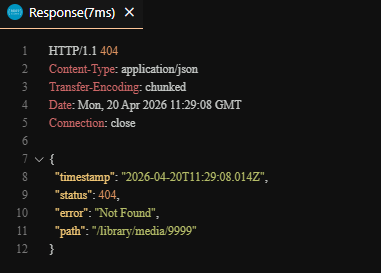

#### Medium löschen
**Request:** `DELETE /library/media/4`
**Erwartet:** 204 No Content, Medium wird gelöscht
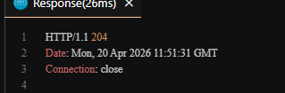

#### Verifikation: GET nach dem Löschen
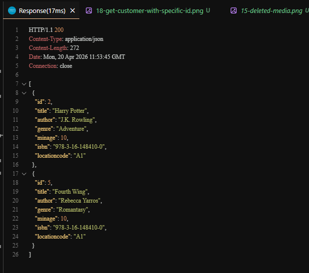

#### Ausgeliehenes Medium löschen
**Request:** `DELETE /library/media/2`
**Erwartet:** 409 Conflict, Medium ist noch ausgeliehen
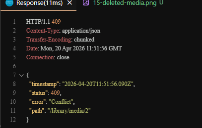

#### Nicht existierendes Medium löschen
**Request:** `DELETE /library/media/9999`
**Erwartet:** 404 Not Found
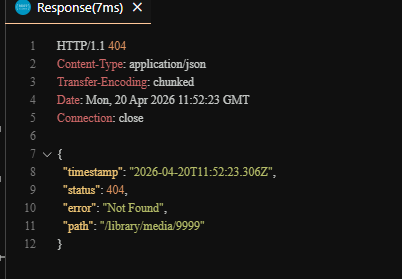

<div style="page-break-after: always;"></div>

### 5.3 Kunden

#### Kunde nach ID abrufen
**Request:** `GET /library/customers/1`
**Erwartet:** 200 OK, JSON Objekt des Kunden
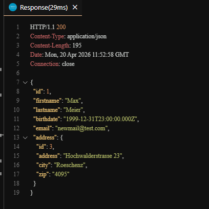

#### Nicht existierenden Kunden abrufen
**Request:** `GET /library/customers/9999`
**Erwartet:** 404 Not Found
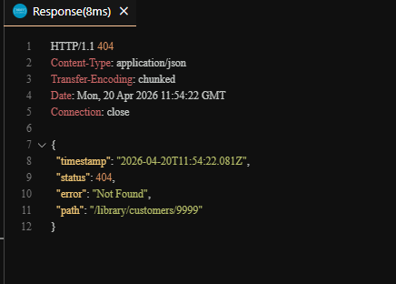

#### Kunden nach Nachname filtern
**Request:** `GET /library/customers?name=Test`
**Erwartet:** 200 OK, JSON Array mit passenden Kunden
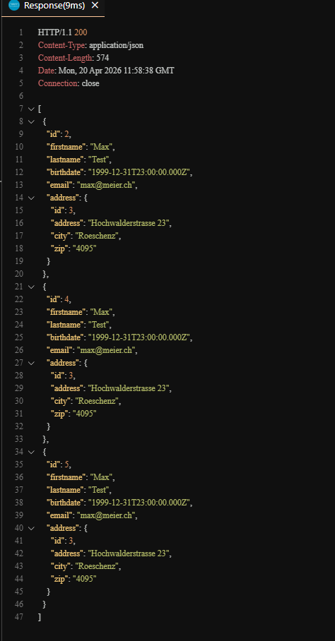

#### Kunden nach Adress-ID filtern
**Request:** `GET /library/customers?addressId=3`
**Erwartet:** 200 OK, JSON Array mit Kunden an dieser Adresse
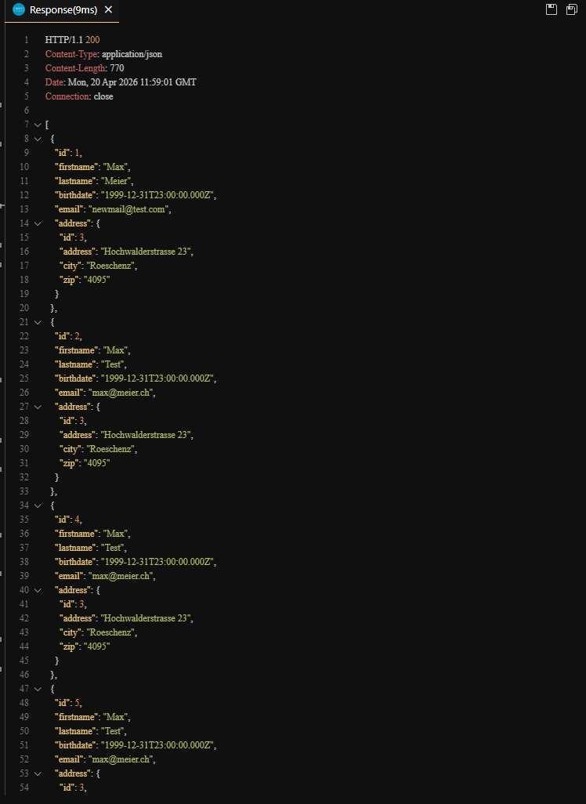

#### Neuen Kunden mit neuer Adresse erstellen
**Request:** `POST /library/customers`
**Erwartet:** 201 Created, Kunde und Adresse werden erstellt
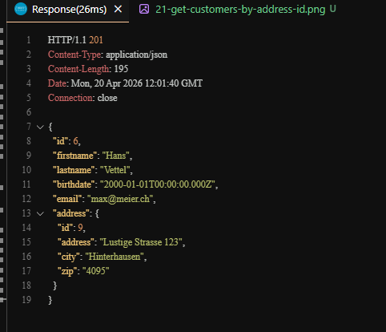

#### Neuen Kunden mit bestehender Adresse erstellen
**Request:** `POST /library/customers`
**Erwartet:** 201 Created, Kunde wird mit bestehender Adresse verknüpft
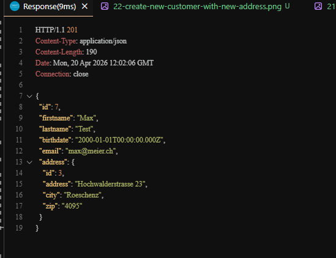

#### Kunden mit nicht existierender Adresse erstellen
**Request:** `POST /library/customers`
**Erwartet:** 404 Not Found, Adresse existiert nicht
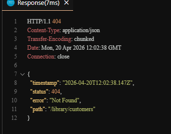

#### Kunden ohne Adresse erstellen
**Request:** `POST /library/customers`
**Erwartet:** 400 Bad Request, Adresse ist erforderlich
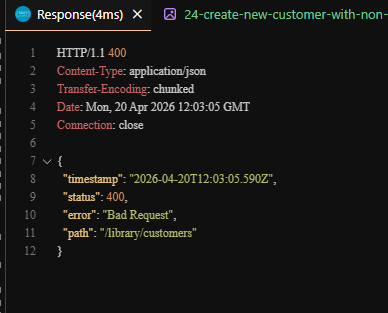

#### Kunden bearbeiten
**Request:** `PATCH /library/customers/1`
**Erwartet:** 200 OK, E-Mail wird aktualisiert
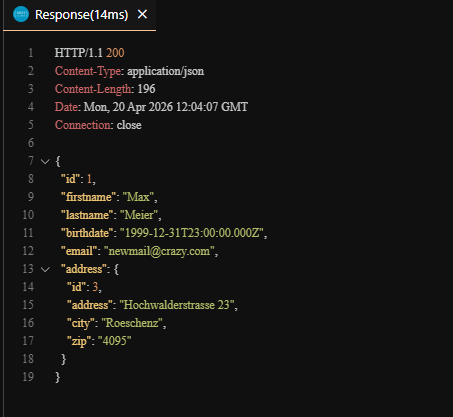

#### Nicht existierenden Kunden bearbeiten
**Request:** `PATCH /library/customers/9999`
**Erwartet:** 404 Not Found
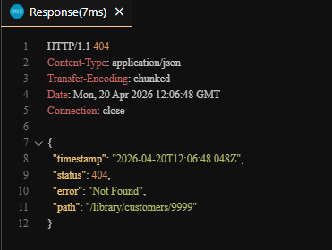

#### Kunden löschen
**Request:** `DELETE /library/customers/1`
**Erwartet:** 204 No Content, Kunde wird gelöscht
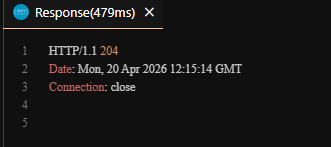

#### Verifikation: GET nach dem Löschen
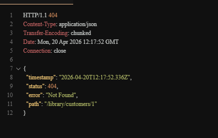

#### Kunden mit offener Ausleihe löschen
**Request:** `DELETE /library/customers/3`
**Erwartet:** 409 Conflict, Kunde hat noch offene Ausleihen
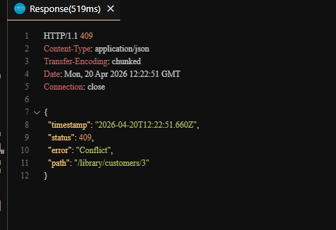

#### Nicht existierenden Kunden löschen
**Request:** `DELETE /library/customers/9999`
**Erwartet:** 404 Not Found
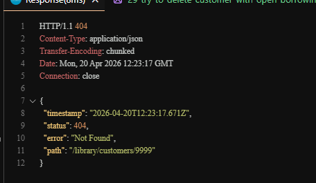

<div style="page-break-after: always;"></div>

### 5.4 Ausleihen

#### Alle Ausleihen abrufen
**Request:** `GET /library/borrowings`
**Erwartet:** 200 OK, JSON Array mit allen aktiven Ausleihen
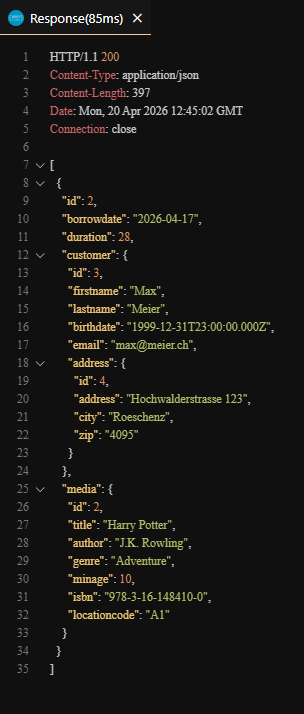

#### Neue Ausleihe erstellen
**Request:** `POST /library/borrowings`
**Erwartet:** 201 Created, Ausleihe wird mit heutigem Datum erstellt
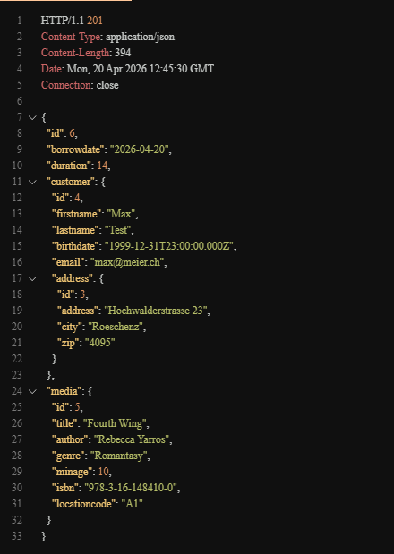

#### Ausleihe mit nicht existierendem Kunden erstellen
**Request:** `POST /library/borrowings`
**Erwartet:** 404 Not Found, Kunde existiert nicht
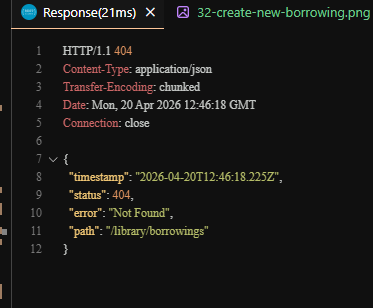

#### Ausleihe mit nicht existierendem Medium erstellen
**Request:** `POST /library/borrowings`
**Erwartet:** 404 Not Found, Medium existiert nicht
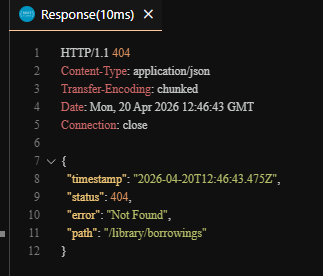

#### Ausleihe mit bereits ausgeliehenem Medium erstellen
**Request:** `POST /library/borrowings`
**Erwartet:** 409 Conflict, Medium ist bereits ausgeliehen
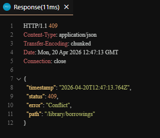

#### Ausleihe verlängern
**Request:** `PATCH /library/borrowings/6`
**Erwartet:** 200 OK, Dauer wird auf 28 Tage aktualisiert
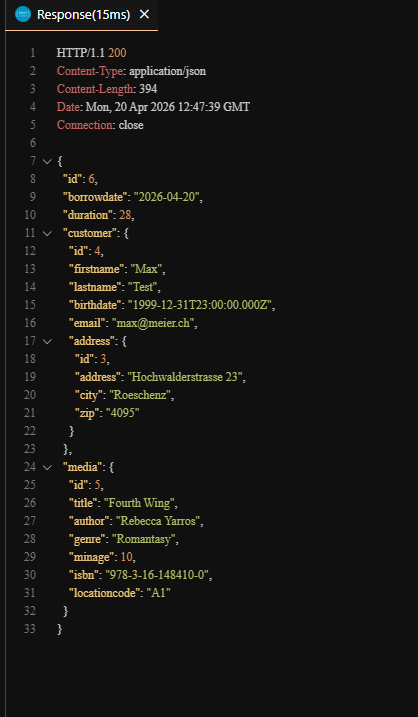

#### Nicht existierende Ausleihe verlängern
**Request:** `PATCH /library/borrowings/9999`
**Erwartet:** 404 Not Found
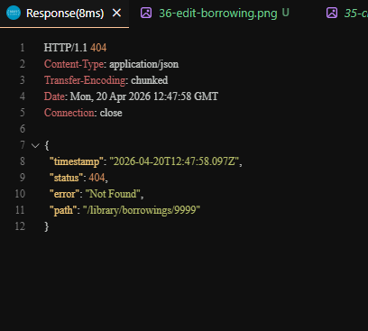

#### Ausleihe beenden
**Request:** `DELETE /library/borrowings?mediaId=5`
**Erwartet:** 204 No Content, Ausleihe wird gelöscht
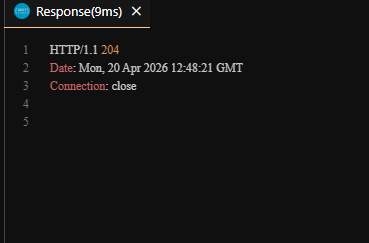

#### Verifikation: GET nach dem Beenden
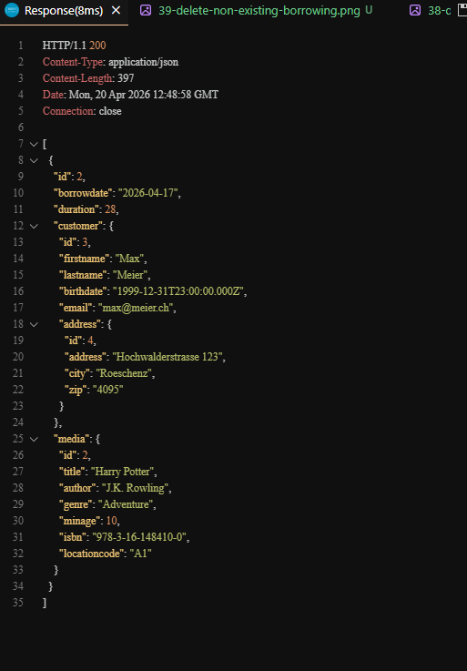

#### Ausleihe mit nicht existierender Media-ID beenden
**Request:** `DELETE /library/borrowings?mediaId=9999`
**Erwartet:** 404 Not Found
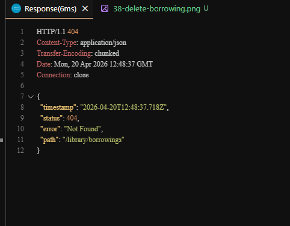
